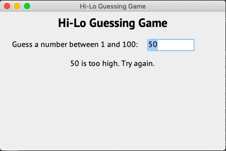

# GuessingGame

A simple Java Swing version of the [HiLo](https://github.com/stormwild/HiLo) guessing game.

## Pre-requisites

- Git
- Java 8 or above
- Visual Studio Code
- Java Extensions for vscode
- Maven

## Setup

- Git clone
- Open folder in Visual Studio Code
- Open GuessingGame.java
- Click Run or Ctrl+F5

## Demo



## Notes

Creating a Helper class with initialization.

To initialize a class with static methods use a static block initializer

```java
static {
    String fonts[] = GraphicsEnvironment.getLocalGraphicsEnvironment().getAvailableFontFamilyNames();
    for (int i = 0; i < fonts.length; i++) {
      availableFonts.put(fonts[i], fonts[i]);
    }
  }
```

- [How to Use Static Initializers in Java](https://www.dummies.com/programming/java/how-to-use-static-initializers-in-java/)
- [Java equivalent to C# extension methods](https://stackoverflow.com/questions/4359979/java-equivalent-to-c-sharp-extension-methods)
- [Java Singleton Design Pattern Best Practices with Examples](https://www.journaldev.com/1377/java-singleton-design-pattern-best-practices-examples)

Enable language features like lambda by specifying release

```xml
<properties>
    <maven.compiler.release>7</maven.compiler.release>
</properties>
```

- [Setting the Java Version in Maven](https://www.baeldung.com/maven-java-version)

## References

- [Learn Java The Easy Way](https://www.amazon.com/Learn-Java-Easy-Way-Hands-ebook/dp/B0713P1RBH)
- [Maven – How to create a Java project](https://www.mkyong.com/maven/how-to-create-a-java-project-with-maven/)
- [Java in Visual Studio Code](https://code.visualstudio.com/docs/languages/java)